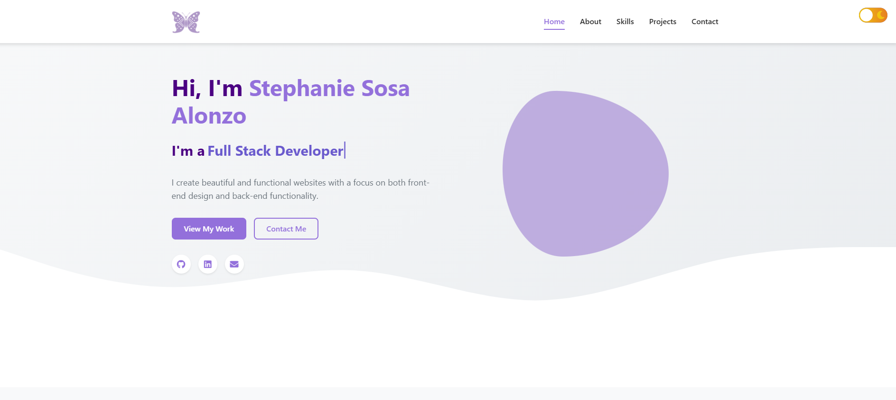

# Stephanie Sosa Alonzo - Portfolio Website 🌟

A modern, responsive portfolio website showcasing my web development projects and skills. Built with React, TypeScript, and Node.js, this site features a clean design with both light and dark mode support.


Visit my portfolio: [stephaniesosa.dev](https://stephaniesosa.dev/)

## Installations

1) Clone the repository
2) Install dependencies for root, client, and server: `npm install`
3) Set up the environment variables by creating a `.env` file in the server directory with:
```sh
EMAIL_USER=your-email@gmail.com
EMAIL_PASSWORD=your-app-password
PORT=3001
NODE_ENV=development
```
4) Start the deployment server: `npm run start:dev`

## Features

✅ **Responsive Design**: Optimized for all device sizes from mobile to desktop

✅ **Dark/Light Mode**: Toggle between themes with a single click

✅ **Project Showcase**: Filterable gallery of my development work

✅ **Skills Section**: Visual representation of my technical abilities 

✅ **Contact Form**: Direct messaging capability using Formspree

✅ **Resume Download**: Easy access to my professional resume

✅ **Animated Elements**: Subtle animations for enhanced user experience

# Contact 📝 
Feel free to reach out to me:

Email: stephaniesosa02@gmail.com

LinkedIn: [Stephanie Sosa Alonzo](https://www.linkedin.com/in/stephanie-sosa-alonzo/)

GitHub: [stephanuh](https://github.com/stephanuh)

## 📜License
This application is covered under [](https://opensource.org/licenses/MIT)